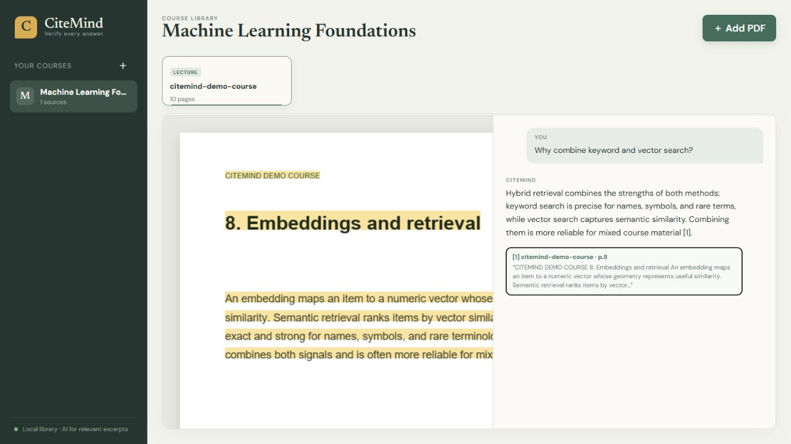
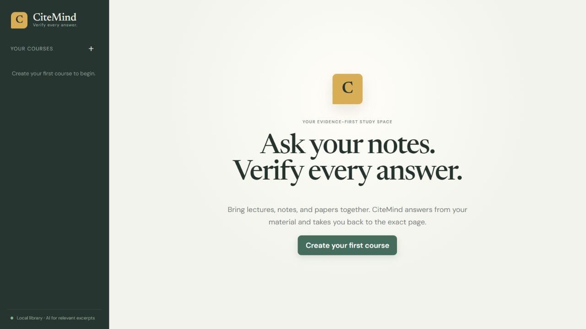
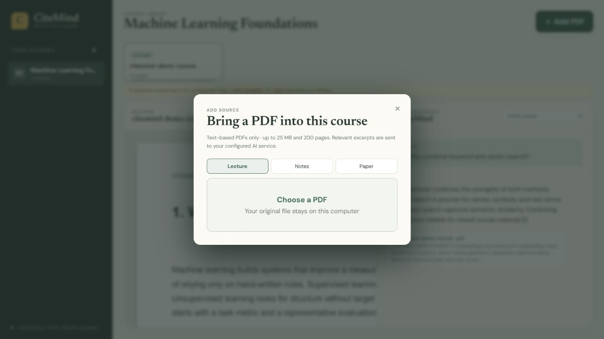
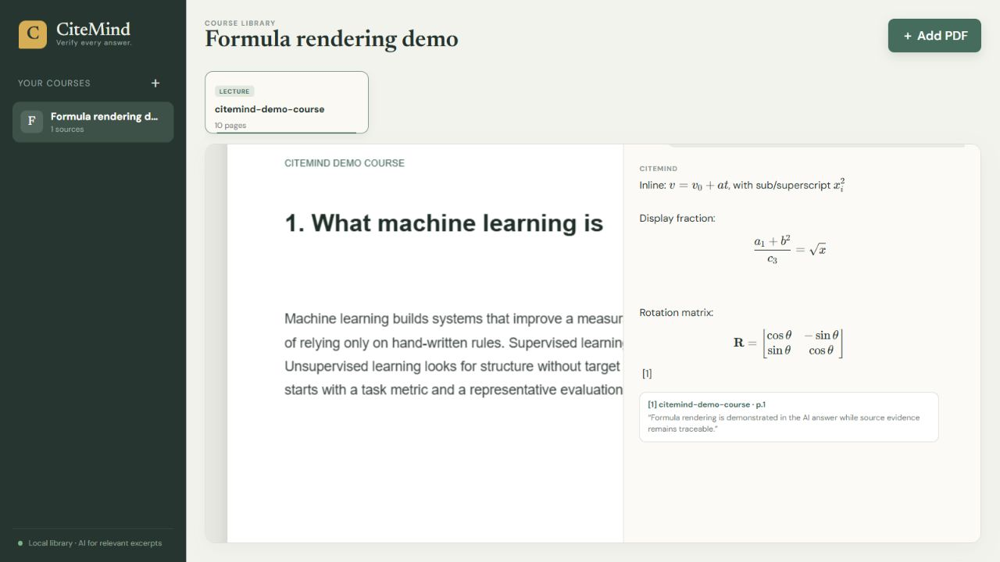
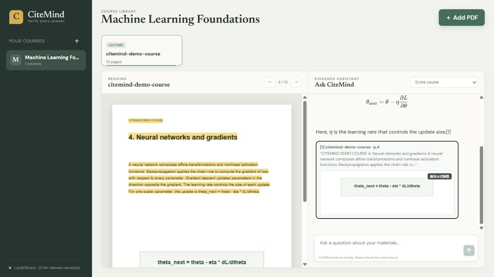
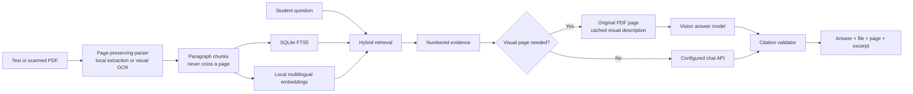

# CiteMind

**Ask your notes. Verify every answer.**



[Watch the 18-second product walkthrough](docs/video/citemind-demo.mp4)

| Welcome | Add a source | Verify evidence |
| --- | --- | --- |
|  |  |  |





CiteMind is a local-first course knowledge base for lecture notes, student notes, and papers. It answers questions only from the uploaded material, attaches a page-level citation to every supported claim, and opens the exact PDF page behind each citation.

> Status: working v0.1 MVP. Text and scanned PDFs with page vision, single user, Windows-first.

## Why CiteMind

Most document chat demos optimize for a fluent answer. CiteMind optimizes for a verifiable answer:

- answers are grounded in one course or one selected document;
- citations are server-validated and cannot name a source the retriever did not supply;
- every citation contains the file, PDF page, and original excerpt;
- clicking evidence opens and highlights the matching PDF page;
- AI answers typeset inline and display LaTeX, including fractions and matrices;
- known legacy `Symbol` formula glyphs are decoded for retrieval, while every citation retains an exact original-page visual preview;
- diagram, plot, and formula questions can inspect one relevant original page with vision; page descriptions are cached after the first use;
- image-only scanned pages are transcribed once during upload and remain searchable with their original PDF page numbers;
- weak retrieval produces “no reliable evidence” instead of a confident guess.

## Quick start

Requirements: Windows 11, Python 3.12, Node.js 20+, and an OpenAI-compatible chat API key.

```powershell
Copy-Item .env.example .env
# Add OPENAI_API_KEY to .env
.\start.ps1
```

Open [http://127.0.0.1:8000](http://127.0.0.1:8000). The first document takes longer because CiteMind downloads a multilingual local embedding model (about 220 MB) once.

Without an API key you can still create courses, upload and read PDFs, build the local index, and open original-page evidence. Add the key later to enable AI answers. If port 8000 is already in use, run `$env:CITEMIND_PORT=8002; .\start.ps1`.

For development, run the backend and frontend separately:

```powershell
cd backend
python -m venv .venv
.\.venv\Scripts\pip install -r requirements.txt
.\.venv\Scripts\uvicorn app.main:app --reload --env-file ..\.env
```

```powershell
cd frontend
npm install
npm run dev
```

## Product flow

1. Create one course.
2. Add text or scanned PDF lectures, notes, or papers.
3. Ask across the course or limit the scope to one document.
4. Visual questions selectively inspect a relevant original page and mark the citation as `视觉核对`.
5. Open any citation to inspect the original page and highlighted evidence.

## Architecture



The stack is intentionally small: React, FastAPI, SQLite/FTS5, PyMuPDF, PDF.js, and FastEmbed. Vectors are JSON rows in SQLite and cosine-ranked in process; this is appropriate for personal course libraries and avoids running a vector database.

## Privacy boundary

- Original PDFs, extracted text, SQLite data, chat history, and embeddings stay in `backend/data/`.
- Embeddings are generated locally with a multilingual ONNX model.
- During scanned-PDF upload, each image-only page is sent once for visual OCR. During questions, only the question, up to fourteen retrieved excerpts (including nearby-page context), at most two recent conversation turns, and at most one relevant original-page image go to the configured AI service.
- API keys are read from `.env`; document text and keys are not logged by CiteMind.
- Deleting a document removes its file and index and clears that course's chat history.

Do not upload material you are not allowed to process. Your AI provider's retention terms still apply to the excerpts sent for answering.

## Deliberate limits

- PDF only; no Word or PowerPoint
- PDFs up to 25 MB and 200 pages; visual OCR is capped at 50 scanned pages per file
- one local user; no accounts, sync, or collaboration
- no cross-course questions
- one configurable OpenAI provider; visual analysis uses the Responses API
- no summaries, flashcards, quiz generation, or knowledge graph

## Quality gates

Run the focused backend checks and the production frontend build:

```powershell
cd backend
.\.venv\Scripts\python -m pytest -q
cd ..\frontend
npm run build
```

The tests cover page provenance, scanned-PDF OCR and cleanup, complete deletion, visual-page selection and caching, safe visual fallback, the full ask/citation response, insufficient-evidence handling, and rejection of fabricated, mismatched, or unsupported answers.

The self-authored English and Chinese demo courses and 30-question retrieval benchmark live in `sample-data/`. Generate the PDFs, index both in one temporary course, and evaluate top-5 page recall:

```powershell
backend\.venv\Scripts\python sample-data\build_sample.py
backend\.venv\Scripts\python backend\evaluate.py --local
```

Current bundled benchmark: **30/30 English and Chinese questions (100%)** retrieve the annotated page in the top five, against an 80% release threshold. Both language sets are searched together in one course. Displayed citation identifiers are server-validated; fabricated or mismatched identifiers fail closed.

See the dated [validation report](docs/VALIDATION.md) for the complete test matrix, including the measured 3.47-second warm-cache indexing time for a generated 100-page text PDF.

Before publishing v1.0, complete the privacy-safe [real-course acceptance checklist](docs/REAL_COURSE_ACCEPTANCE.md).

The current engineering candidate is documented in the [v0.1.7 release notes](docs/RELEASE_NOTES_v0.1.7.md). Seven private tutorials (222 pages) are indexed together and the formula-evidence path has been rechecked, but CiteMind is not represented as v1.0 until a clean AI comparison session and the required lecture/notes/paper source mix pass.

## Repository map

```text
backend/app/       API, storage, retrieval, and citation validation
backend/tests/     focused risk-chain tests
frontend/src/      React workspace and PDF evidence viewer
sample-data/       self-authored demo course and retrieval benchmark
ROADMAP.md         frozen v1 scope and later ideas
```

## Known risks

PDF text extraction can scramble unusually complex multi-column layouts. Prompt injection inside source files is treated as untrusted reference text, but no LLM control is absolute. Always inspect cited evidence before relying on an answer.

## License

[MIT](LICENSE). The generated demo document is also released under CC0-1.0.
